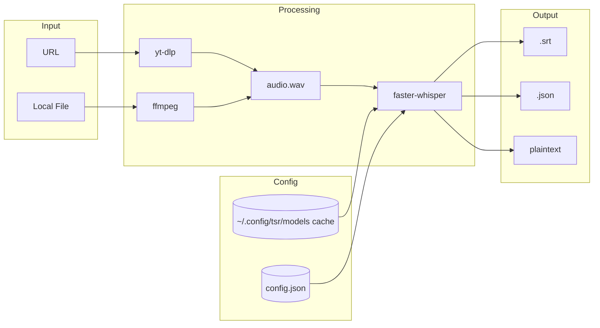

# tsr

CLI tool to transcribe audio or video files using `faster-whisper`.

## Requirements

- Python `>=3.13`
- `ffmpeg` available on `PATH` (required for video inputs)
- `yt-dlp` available on `PATH` (optional, for URL transcription)

On macOS:
```bash
brew install ffmpeg yt-dlp
```

## Install

**Global install** (recommended):
```bash
uv tool install git+https://github.com/ynbh/tsr.git
```

Then use `tsr` directly:
```bash
tsr --help
```

**Local development**:
```bash
uv sync
uv run tsr --help
```

## Quick Start

1. Download a model:

```bash
tsr download base
```

2. (Optional) Set default model:

```bash
tsr model base
```

3. Transcribe a file:

```bash
tsr run path/to/audio_or_video.mp4
```

This writes an `.srt` file by default next to the input.

## Commands

`tsr download [tiny|base|small|medium|large]`
- Prefetches and caches the mapped `faster-whisper` model into `~/.config/tsr/models`.
- `large` maps to `large-v3`.

`tsr model [size]`
- Without `size`, opens an interactive model list (arrow keys + Enter) and saves your selection as default.
- With `size`, updates default model in `~/.config/tsr/config.json`.

`tsr run <input> [--output <path>] [--format srt|json] [--model <size>] [--plain]`
- Transcribes supported audio/video input.
- If the selected model is missing locally, it is downloaded automatically by `faster-whisper`.
- If `--output` is omitted, output path is inferred from input extension.
- `--plain` prints plaintext transcript to terminal and skips writing a file.

## Supported Input Types

- Audio: `.wav`, `.mp3`, `.m4a`, `.flac`, `.ogg`, `.opus`
- Video: `.mp4`, `.mkv`, `.avi`, `.mov`, `.webm`
- URLs: Any site supported by yt-dlp (YouTube, Vimeo, etc.)

## Architecture



## Notes

- Video files are converted to mono 16kHz WAV with `ffmpeg` before transcription.
- URLs are downloaded as audio-only via `yt-dlp`.
- `faster-whisper` loads models by name and caches them under `~/.config/tsr/models`.
- Subprocess failures from `ffmpeg` or `yt-dlp` are surfaced directly.
